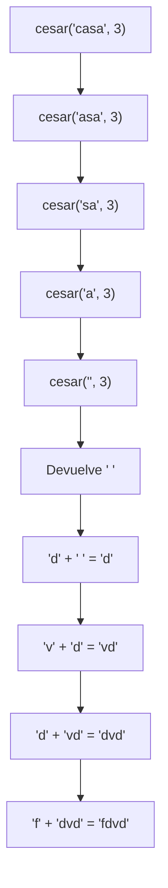
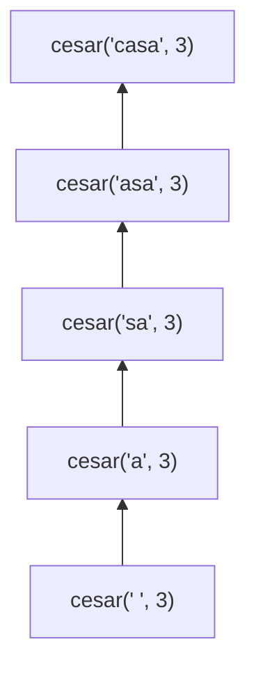
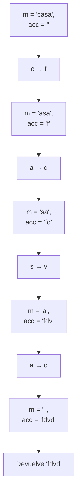
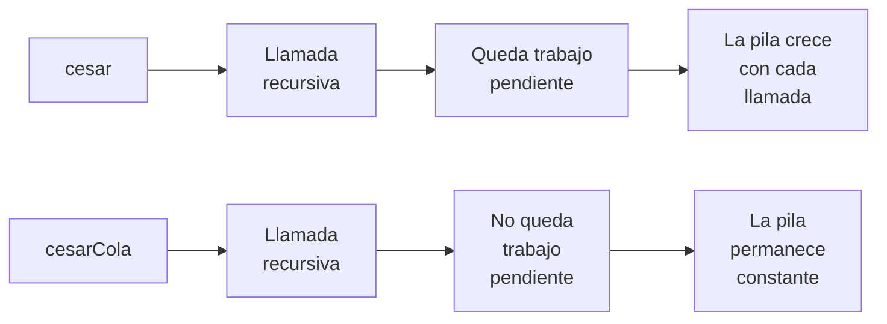

# Informe de proceso — Cifrados clásicos

## 1. Introducción

En este taller se implementan dos versiones del cifrado César:

* `cesar`, mediante **recursión lineal**.
* `cesarCola`, mediante **recursión de cola**.

Ambas funciones producen el mismo resultado, pero la forma en que realizan las llamadas recursivas es diferente. Esta diferencia afecta directamente al uso de la pila de ejecución.

Para analizar el comportamiento se utiliza el ejemplo:

```scala
cesar("casa", 3)
```

y su equivalente:

```scala
cesarCola("casa", 3)
```

El mensaje contiene cuatro letras:

$$
c,\ a,\ s,\ a
$$

y el desplazamiento es:

$$
k=3
$$

El alfabeto utilizado contiene las 26 letras minúsculas del alfabeto inglés.

El desplazamiento de una letra se calcula mediante:

$$
p' = (p+k)\bmod 26
$$

donde \(p\) representa la posición de la letra en el alfabeto.

Por ejemplo:

$$
c \rightarrow f
$$

$$
a \rightarrow d
$$

$$
s \rightarrow v
$$

$$
a \rightarrow d
$$

Por tanto:

$$
\texttt{"casa"} \rightarrow \texttt{"fdvd"}
$$

---

# 2. Proceso de `cesar`

La función `cesar` utiliza recursión lineal. En cada llamada procesa la primera letra del mensaje y realiza otra llamada recursiva para procesar el resto.

La estructura relevante es:

```scala
def cesar(m: Mensaje, k: Int): Mensaje = {
  if (m.isEmpty) ""
  else {
    val primero = m.head
    val resto = m.tail

    if (esMinuscula(primero)) {
      val posicion = primero.toInt - primera
      val nuevaPosicion = (posicion + k) % letras
      val ajustada = if (nuevaPosicion < 0) nuevaPosicion + letras 
      else nuevaPosicion
      val nuevaLetra = (primera + ajustada).toChar

      nuevaLetra + cesar(resto, k)
    } else {
      primero + cesar(resto, k)
    }
  }
}
```

La característica importante es que después de realizar la llamada recursiva todavía queda una operación pendiente:

```scala
nuevaLetra + cesar(resto, k)
```

Por esta razón, la llamada recursiva no es la última operación que se realiza.

## 2.1. Primera llamada

Comenzamos con:

```scala
cesar("casa", 3)
```

La primera letra es:

```text
c
```

Su posición en el alfabeto es:

$$
2
$$

Aplicando el desplazamiento:

$$
(2+3)\bmod 26=5
$$

La posición \(5\) corresponde a:

```text
f
```

Pero la función todavía no puede devolver `"f"`, porque necesita cifrar el resto del mensaje:

```text
asa
```

Por tanto, realiza:

```scala
cesar("asa", 3)
```

En este momento queda pendiente realizar:

```scala
'f' + resultado
```

---

## 2.2. Segunda llamada

Ahora se evalúa:

```scala
cesar("asa", 3)
```

La primera letra es:

```text
a
```

Su posición es:

$$
0
$$

Aplicando el desplazamiento:

$$
(0+3)\bmod 26=3
$$

que corresponde a:

```text
d
```

La función vuelve a llamar recursivamente a:

```scala
cesar("sa", 3)
```

Pero ahora queda pendiente:

```scala
'd' + resultado
```

La pila contiene entonces las dos operaciones pendientes:

```text
'f' + resultado
'd' + resultado
```

---

## 2.3. Tercera llamada

Se evalúa:

```scala
cesar("sa", 3)
```

La primera letra es:

```text
s
```

Su posición es:

$$
18
$$

Aplicando el desplazamiento:

$$
(18+3)\bmod 26=21
$$

que corresponde a:

```text
v
```

Se realiza una nueva llamada:

```scala
cesar("a", 3)
```

y queda pendiente:

```scala
'v' + resultado
```

La pila continúa creciendo.

---

## 2.4. Cuarta llamada

Ahora:

```scala
cesar("a", 3)
```

La letra es:

```text
a
```

y:

$$
(0+3)\bmod 26=3
$$

por lo que se obtiene:

```text
d
```

Se realiza la última llamada:

```scala
cesar("", 3)
```

Queda pendiente:

```scala
'd' + resultado
```

---

## 2.5. Caso base

La llamada:

```scala
cesar("", 3)
```

encuentra el mensaje vacío y devuelve directamente:

```scala
""
```

Ahora comienza el **desenrollado de la recursión**.

La última llamada puede completar su operación:

$$
d + "" = "d"
$$

Después, la llamada anterior puede completar:

$$
v + "d" = "vd"
$$

Luego:

$$
d + "vd" = "dvd"
$$

Finalmente:

$$
f + "dvd" = "fdvd"
$$

Por tanto:

```text
cesar("casa", 3) = "fdvd"
```

---

## 2.6. Evolución de la pila

El proceso puede representarse de la siguiente manera:



Durante la fase de llamadas, la pila crece:



En el punto de mayor profundidad existen cinco llamadas activas:

$$
cesar("casa",3)
$$

$$
cesar("asa",3)
$$

$$
cesar("sa",3)
$$

$$
cesar("a",3)
$$

$$
cesar("",3)
$$

Por tanto, para un mensaje de longitud \(n\), la profundidad de la recursión es proporcional a \(n\):

$$
\boxed{O(n)}
$$

en espacio de pila.

---

# 3. Proceso de `cesarCola`

La segunda implementación realiza el mismo cifrado, pero utiliza un acumulador:

```scala
@tailrec
final def cesarCola(m: Mensaje, k: Int, acc: Mensaje = ""): Mensaje = {
  if (m.isEmpty) acc
  else {
    val primero = m.head
    val resto = m.tail

    if (esMinuscula(primero)) {
      val posicion = primero.toInt - primera
      val nuevaPosicion = (posicion + k) % letras
      val ajustada = if (nuevaPosicion < 0) nuevaPosicion + letras 
      else nuevaPosicion
      val nuevaLetra = (primera + ajustada).toChar

      cesarCola(resto, k, acc + nuevaLetra)
    } else {
      cesarCola(resto, k, acc + primero)
    }
  }
}
```

La diferencia fundamental está en que la llamada recursiva es la **última operación** de cada paso.

Por ejemplo:

```scala
cesarCola(resto, k, acc + nuevaLetra)
```

No existe una operación pendiente después de esta llamada.

El resultado parcial se almacena en:

```scala
acc
```

Por ello, cuando se llega al caso base, el acumulador ya contiene el resultado completo.

---

## 3.1. Primera llamada

Comenzamos con:

```scala
cesarCola("casa", 3, "")
```

La primera letra es:

```text
c
```

y se transforma en:

```text
f
```

El acumulador pasa de:

```text
""
```

a:

```text
"f"
```

La siguiente llamada es:

```scala
cesarCola("asa", 3, "f")
```

Esta llamada es la última operación de la función.

---

## 3.2. Segunda llamada

Ahora:

```scala
cesarCola("asa", 3, "f")
```

La letra:

```text
a
```

se transforma en:

```text
d
```

El acumulador pasa a:

```text
"fd"
```

y se realiza:

```scala
cesarCola("sa", 3, "fd")
```

---

## 3.3. Tercera llamada

Tenemos:

```scala
cesarCola("sa", 3, "fd")
```

La letra:

```text
s
```

se transforma en:

```text
v
```

El acumulador queda:

```text
"fdv"
```

y se realiza:

```scala
cesarCola("a", 3, "fdv")
```

---

## 3.4. Cuarta llamada

Tenemos:

```scala
cesarCola("a", 3, "fdv")
```

La letra:

```text
a
```

se transforma en:

```text
d
```

El acumulador queda:

```text
"fdvd"
```

La siguiente llamada es:

```scala
cesarCola("", 3, "fdvd")
```

---

## 3.5. Caso base

Cuando el mensaje está vacío:

```scala
if (m.isEmpty) acc
```

la función devuelve directamente:

```text
"fdvd"
```

No existe una fase posterior de concatenación ni de reconstrucción del resultado.

Por tanto:

```text
cesarCola("casa", 3) = "fdvd"
```

---

# 4. Evolución del acumulador

El proceso puede resumirse así:



A diferencia de `cesar`, no es necesario guardar operaciones pendientes como:

```text
f + resultado
d + resultado
v + resultado
d + resultado
```

Cada paso incorpora directamente el carácter cifrado al acumulador.

---

# 5. Comparación de las dos versiones

Las dos funciones producen el mismo resultado:

$$
\boxed{cesar("casa",3)=cesarCola("casa",3)="fdvd"}
$$

Sin embargo, el proceso de evaluación es diferente.

### `cesar`

La llamada tiene esta estructura:

```scala
nuevaLetra + cesar(resto, k)
```

Por lo tanto, después de la llamada recursiva todavía hay trabajo pendiente.

El proceso es:

```text
llamadas
   ↓
crecimiento de la pila
   ↓
caso base
   ↓
desenrollado
   ↓
construcción del resultado
```

Para un mensaje de longitud \(n\), la profundidad de la pila es:

$$
\boxed{O(n)}
$$

---

### `cesarCola`

La llamada tiene esta estructura:

```scala
cesarCola(resto, k, acc + nuevaLetra)
```

La llamada recursiva es la última operación.

El proceso es:

```text
llamada
   ↓
actualizar acumulador
   ↓
siguiente llamada
   ↓
actualizar acumulador
   ↓
...
   ↓
caso base
   ↓
devolver acumulador
```

La función está anotada con:

```scala
@tailrec
```

por lo que el compilador comprueba que la llamada recursiva tenga la forma de una recursión de cola.

La profundidad de la pila se mantiene constante, independientemente del tamaño del mensaje:

$$
\boxed{O(1)}
$$

en espacio de pila.

---

# 6. ¿Por qué una pila crece y la otra no?

La diferencia fundamental no está en la cantidad de caracteres procesados, sino en **qué queda por hacer después de cada llamada recursiva**.

En `cesar`:

```scala
nuevaLetra + cesar(resto, k)
```

la función debe recordar la `nuevaLetra` y esperar a que termine la llamada recursiva para poder concatenarla con el resultado.

Cada llamada agrega un nuevo marco de ejecución a la pila.

Por eso:

$$
\text{profundidad de pila} \propto n
$$

En `cesarCola`:

```scala
cesarCola(resto, k, acc + nuevaLetra)
```

el resultado parcial ya está almacenado en `acc`. No hay ninguna operación pendiente después de la llamada recursiva.

Por ello, una implementación de recursión de cola puede reutilizar el mismo espacio de pila.



---

# 7. Conclusión

`cesar` y `cesarCola` implementan el mismo algoritmo de cifrado y producen el mismo resultado para el mensaje analizado:

$$
\boxed{\texttt{"casa"} \xrightarrow{k=3} \texttt{"fdvd"}}
$$

La diferencia está en la estrategia de recursión.

`cesar` utiliza recursión lineal y conserva operaciones pendientes mientras desciende hacia el caso base. Por ello, necesita una cantidad de espacio de pila proporcional al tamaño del mensaje:

$$
\boxed{O(n)}
$$

`cesarCola` utiliza un acumulador y realiza la llamada recursiva como última operación. Esto permite utilizar recursión de cola y mantener constante el espacio de pila:

$$
\boxed{O(1)}
$$

Esta diferencia se vuelve especialmente importante para mensajes grandes. La versión `cesarCola` puede procesar mensajes largos sin que la profundidad de la recursión provoque un desbordamiento de la pila, mientras que `cesar` puede alcanzar una profundidad proporcional al número de caracteres procesados.
